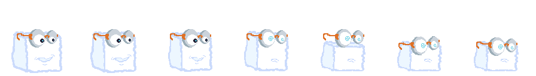
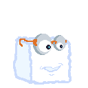

# Godot v4 Game Engine Projects

Hiya! These are the projects I've been making and exploring with in using the [Godot Game Engine](https://godotengine.org/).

This repo is specifically using the 4.x version of the application, and the associated Godot Script (`.gd`, gdScript) Language.

<!-- MarkdownTOC -->

- [Projects](#projects)
    - [Tofu Flâneur](#tofu-fl%C3%A2neur)
- [License](#license)
    - [Quick Summary of License](#quick-summary-of-license)
    - [Why _this_ License?](#why-this-license)
- [References](#references)

<!-- /MarkdownTOC -->

## Projects

This section covers the summaries and links for the projects that exist in this repo.

### Tofu Flâneur

This is my first game project with Godot, using Pixel Graphics I've created through [Aseprite](https://www.aseprite.org/) and/or [Pixaki](https://pixaki.com/), which I've made on macOS or iPadOS.

I'm building in [Godot 4](https://godotengine.org/) with Godot Script on a macOS M2 System.

At the moment, I don't know what this game is or will be, I'm just messing around with trying to learn how to use Godot and the [Sprite Sheets](https://www.aseprite.org/docs/sprite-sheet/) I've made with Aseprite, so don't be surprised if it just looks like a confused mess (because it totally is).

See the [`TofuFlaneur/`](./TofuFlaneur/) directory, locally, in this repo and open the [`project.godot`](./TofuFlaneur/project.godot) file with __Godot 4__ to explore the game project.

## License

[CC BY-NC-ND 4.0](https://creativecommons.org/licenses/by-nc-nd/4.0/legalcode), see [LICENSE](./LICENSE) file in this repo.

### Quick Summary of License

- Attribution: You must give appropriate credit, provide a link to the license, and indicate if changes were made. You may do so in any reasonable manner, but not in any way that suggests the licensor endorses you or your use.
- NonCommercial: You may not use the material for commercial purposes.
- NoDerivatives: If you remix, transform, or build upon the material, you may not distribute the modified material.

### Why _this_ License?

Not tryin' to be a jerk, but I wanna see what I can make and if I do make a neat game or somethin' I wanna turn into a business or sell to someone, then I don't think it'd be great for me to just put this all out there without any kind of Software License protections.

That being said, I do wanna help anyone who wants to learn, just like how I'm learning from free and open software development documentation and code examples.

So you're free to clone this repo locally and look around and learn from it, as long as you're not doing that directly to improve a commercial project or a existing/new business.

## References

- https://godotengine.org/
- https://www.aseprite.org/
- https://pixaki.com/
